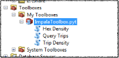
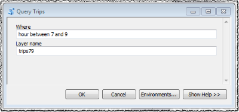
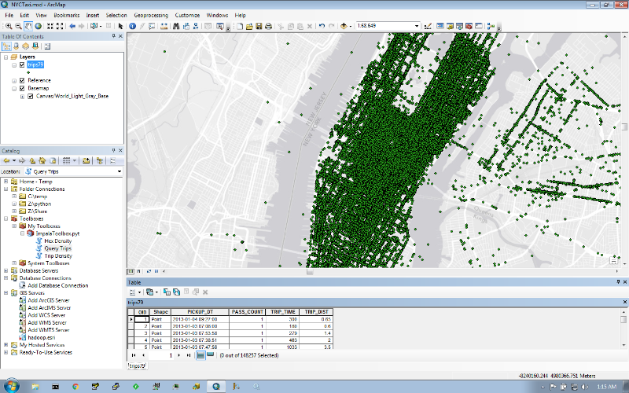
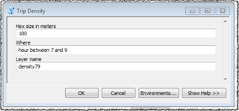
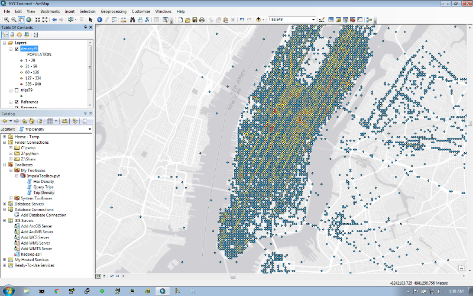
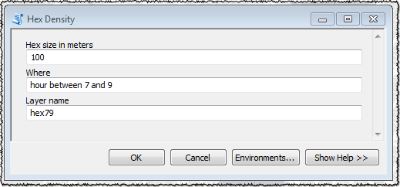
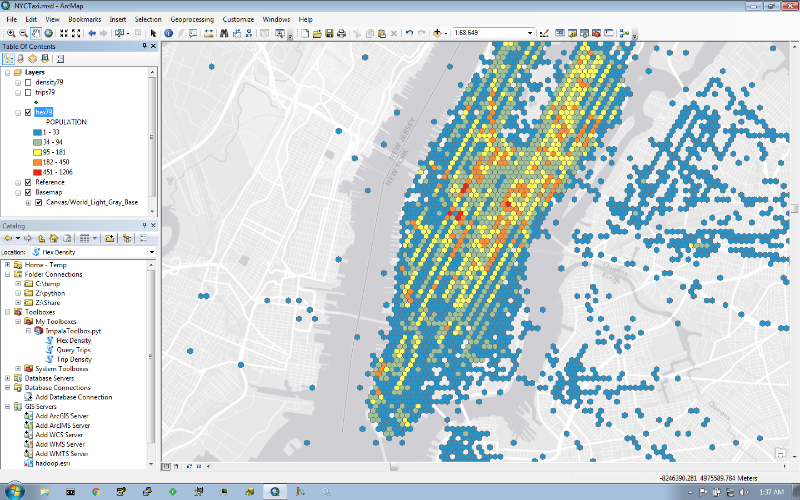

# Spark Multiple Outputs

Spark job to demonstrate a way to emit multiple outputs to HDFS from an input source field criteria.
The most common criteria is temporal based, where given a date input field, the HDFS output path is based on the field content.
For example, an input row with a date field with content `YYYY-MM-dd HH:mm:ss` will be placed into a file with a path based on `YYYY/MM/dd/HH`.

Once the data is partitioned, it can be mapped into an [Impala](https://www.cloudera.com/products/apache-hadoop/impala.html) table, in such that it can be queried with schema-on-read mapping to be visualized on map.

## Building The Project

This project depends on:

* [FastTok](https://github.com/mraad/FastTok)
* [HexGrid](https://github.com/mraad/hex-grid)
* [WebMercator](https://github.com/mraad/WebMercator)

Build the project using [Maven](https://maven.apache.org/):

```bash
mvn package
```

## Run The Project

We will use the [New York City taxi trips](http://www.nyc.gov/html/tlc/html/about/trip_record_data.shtml) data as a CSV input.

Download a [sample 1 million records](https://dl.dropboxusercontent.com/u/2193160/trips-1M.csv.7z), and place it into HDFS:

```bash
hdfs dfs -mkdir trips
hdfs dfs -put trips-1M.csv trips
```

Create the output base folder:

```
sudo -u hdfs hdfs dfs -mkdir /trips
sudo -u hdfs hdfs dfs -chmod a+rw /trips
```

The following is a sample run:

```
spark-submit\
 --conf spark.app.id=MultipleOutput\
 --name MultipleOutput\
 --master yarn-client\
 --executor-cores 2\
 --num-executors 1\
 --executor-memory 2G\
 target/spark-multi-output-0.1.jar\
 trips hdfs:///trips /tmp/alter-table.hql
```

The above creates 2 artifacts:
 
1 - A set of folders based on the pattern `hdfs:///trips/YYYY/MM/dd/HH/uuid`, where `uuid` is a unique file name.
The rows in the `uuid` files are binned based on the pickup date and time. In addition the pickup `lat/lon` field values are converted to [WebMercator](https://en.wikipedia.org/wiki/Web_Mercator) meter values, and finally, each output row is augmented with [hex cell values](http://thunderheadxpler.blogspot.com/2015/01/scala-hexagon-tessalation.html) at 25,50,100 and 200 meters.
The latter are used to spatially bin the data in addition to the temporal binning based path for visualization.

2 - A file with [HQL](https://cwiki.apache.org/confluence/display/Hive/LanguageManual) statements that will be used later on.
 
## Querying The Data

The partitioned data is mapped to an [Impala](https://www.cloudera.com/products/apache-hadoop/impala.html) table to be queried (Check out the `Data Unit` section in [this](https://cwiki.apache.org/confluence/display/Hive/Tutorial) tutorial for more details on the defintion of partition).
The following is the content of the mapping file `create-table.hql`:

```sql
drop table if exists trips;
create external table if not exists trips (
pickupdatetime string,
dropoffdatetime string,
pickupx double,
pickupy double,
dropoffx double,
dropoffy double,
passengercount int,
triptime int,
tripdist double,
rc25 string,
rc50 string,
rc100 string,
rc200 string
) partitioned by (year int, month int, day int, hour int)
row format delimited
fields terminated by ','
lines terminated by '\n'
stored as textfile;
```

The content of the above generated HQL file alters the table by defining partition pseudo fields and path locations.  For example:

```sql
alter table trips add if not exists partition (year=2013,month=01,day=01,hour=01) location 'hdfs:///trips/2013/01/01/01';
```

Merge the two files and create the table:

```bash
cat create-table.hql /tmp/alter-table.hql > /tmp/tmp.hql
impala-shell --quiet -f /tmp/tmp.hql
```

## Viewing The Data

A [Python based toolbox](http://desktop.arcgis.com/en/arcmap/10.3/analyze/creating-tools/a-quick-tour-of-python-toolboxes.htm) with the [Impyla](https://github.com/cloudera/impyla) module will be used to visualize the content of the table.

Adjust the `PATH` system environment variable with the following values:

```
C:\Python27\ArcGIS10.3;C:\Python27\ArcGIS10.3\Scripts
```

Before installing the Impyla module, make sure to install the [Microsoft Visual C++ Compiler for Python 2.7](https://www.microsoft.com/en-us/download/details.aspx?id=44266).

```
pip2.7 install impyla
```
 
Add the `ImpalaToolbox.pyt` to `My Toolboxes`:



### QueryTrips Tool



This tools enables the user to enter a `where` clause constraining an Impala query when retrieving data rows.  The rows are converted to features and appended to a feature class that is added to display for visualization.



### TripDensity Tool



Rather than retrieving a plethora of features onto the client side, we will let the server perform a SQL aggregation in the following form:

```sql
select
T.C*100+50 as X,
T.R*100+50 as Y,
count(*) AS POPULATION from (
    select
    cast(floor(pickupx/100) as int) as C,
    cast(floor(pickupy/100) as int) as R
    from trips where {w}) T
    group by T.R,T.C
```

The `100` value in the above statement is a cell size, and `{w}` is the input `where` clause.
The rows in the result set consist of cell center location and the count of trip pickups in that cell.



### HexDensity Tool



Rather than rendering the aggregation of trip pickups by a single location, a hexagonal polygon represents the area by this tool.
The hexagon representation in the table (`rc{cell_size}`) is used to `group by` and aggregate. 

```sql
select rc100,count(rc100)
from trips
where {w}
group by rc100
```



#### TODO

* Show how to start a [Docker Cloudera Quickstart](https://blog.cloudera.com/blog/2015/12/docker-is-the-new-quickstart-option-for-apache-hadoop-and-cloudera/).
* Show how to use SparkSQL and [ThriftServer2](http://spark.apache.org/docs/latest/sql-programming-guide.html#running-the-thrift-jdbcodbc-server).
* Convert output to [Parquet](http://parquet.apache.org/) format.
